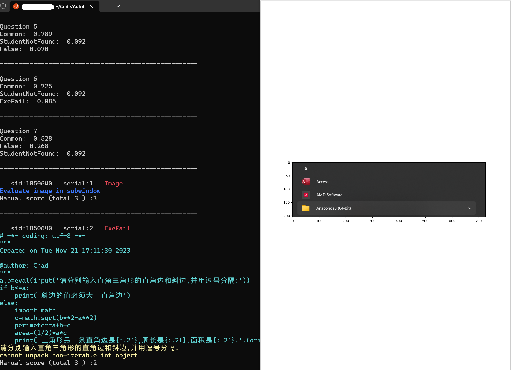

# Auto-P-C : AutoGrader for Python Submissions in Canvas
## Introduction
It is so difficult to use the "SpeedGrader" in Canvas😠

* Cumbersome filling in the blanks
* Duplicate file name
* Download, open, execute and evalute each file and each person

I need a tool to do all this in one window(actually 2 or 3, but 1 if you only grade python submissions)



## Terms and Conditions

### Limited in Linux/WSL
Due to the fact that beginners can easily write infinite loop code, a time-limited running mechanism is necessary. Unfortunately, We haven't find a good way to realize this in Windows, mostly because the multi-threading mechanism required for time-limited running is more commonly used in Linux.
### Python submissions/ Image submissions
Currently, only automatic/manual grading of python submissions and auxiliary manual grading of jpg/jpeg/png submissions have been written. Other files only integrate the scoring function.
### Suitable for canvas platform
Designed export files and rubrics for Canvas platform.
## Instructions

1. Clone this Reposity to anywhere you like in your machine.
1. Adjust configuration files in ./config to make it suitable for your task.
1. Prepare the rules to examine students' submissions of each question(Only for Python submission)(Not Necessary)
1. run scripts/captor.py in ./
```bash
python scripts/captor.py --config ./config/yourconfigname.yaml
```

## Features to be Added

* (Completed) Config
* (Completed) tqdm in running and autograding
* (Completed) Split autograder and manual grader
* (Completed) Run once for multiple assesment
* (Completed) Autograde once for multiple assesment
* (Completed) Manual History : No useless print
* (Completed) Fixed correction order
* (Completed) Incremental submission
* (Completed) Output between auto and manual
* (Completed) png/jpg support
* (Completed) othor file in manual
* More in future by the author
* This is such a simple procedure that you can add what features you need by yourself easily!